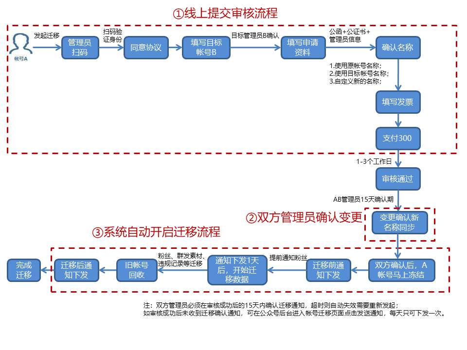

# openId转换工具

> 此项目用于微信公众号主体迁移时，将原来用户的openid通过接口查询到新的openid，项目使用javafx+Oracle jdk1.8开发，有关迁移说明，请参照腾讯官方文档https://kf.qq.com/faq/1901177NrqMr190117nqYJze.html

请务必在双方管理员确认之前将openid转换完成，否则一旦确认后旧帐号任何接口都将无法使用，此时已无法获取关注用户的信息，也无法获取旧帐号的accessToken

